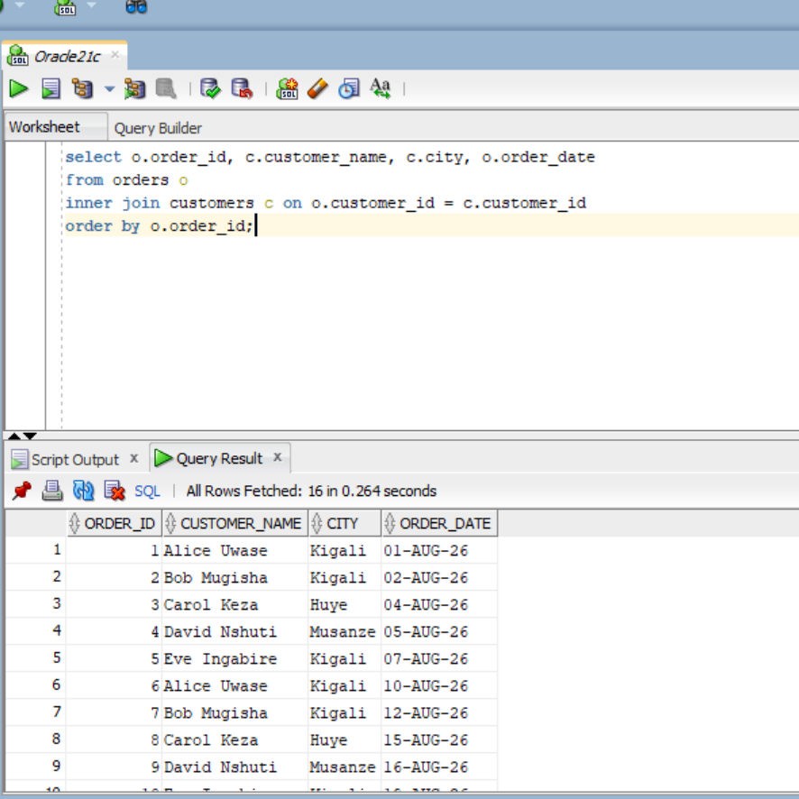
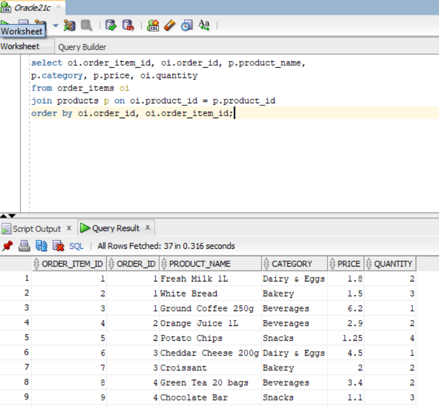
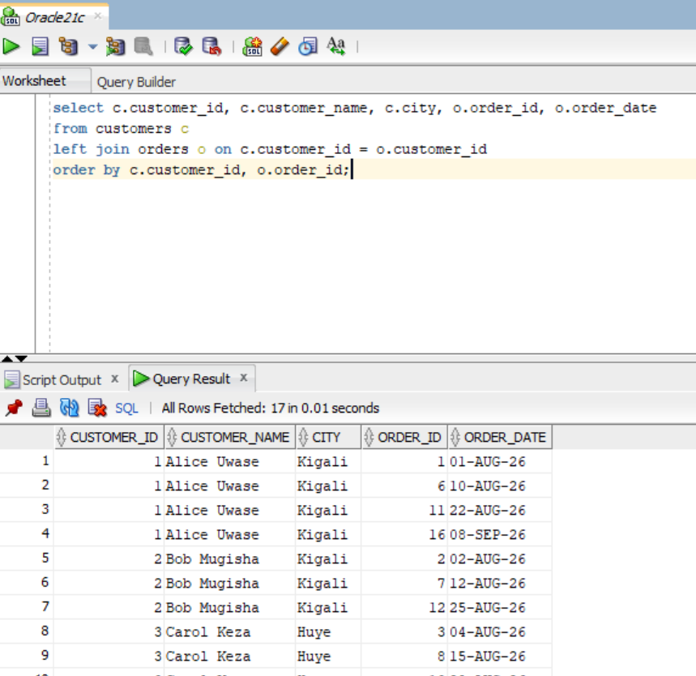
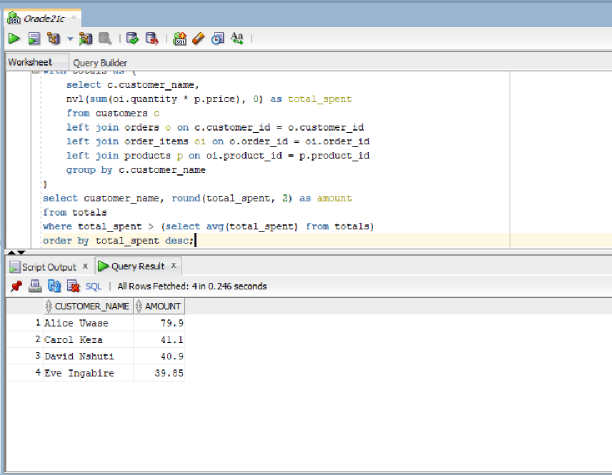
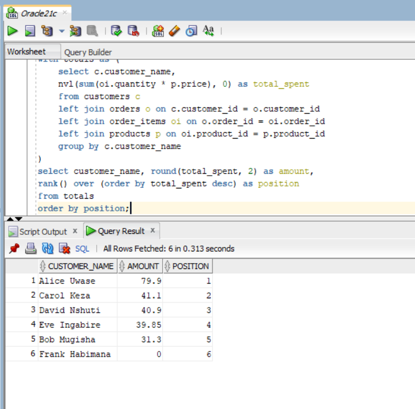
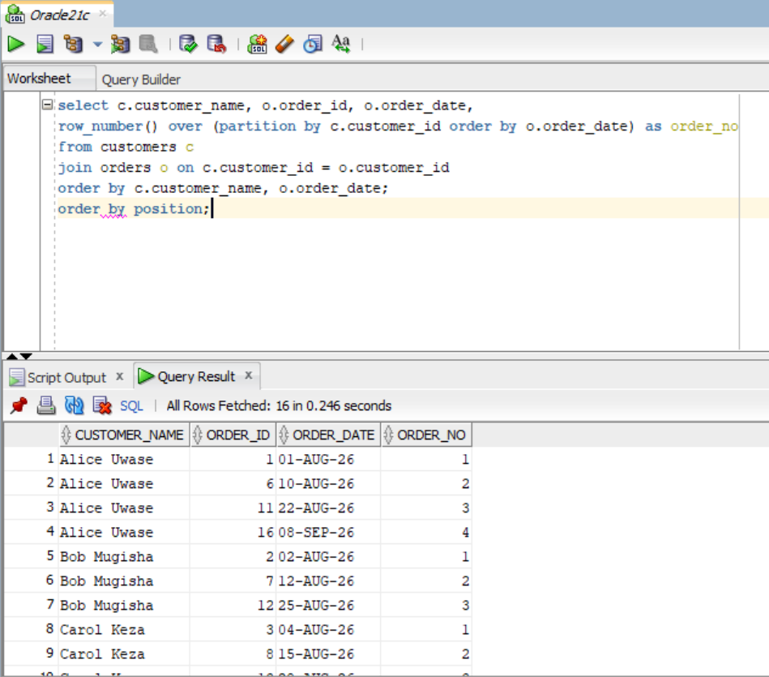
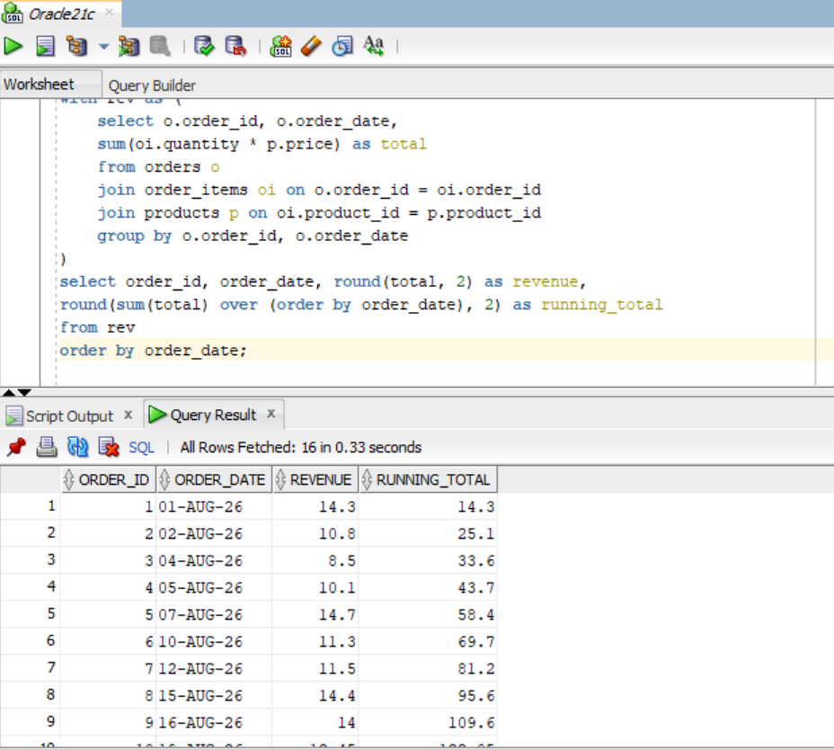
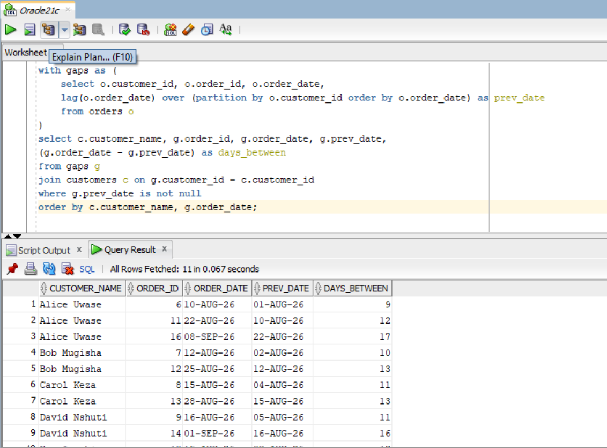

# Assignment 1 — Sunrise Supermarket (JOIN, CTE & Window Functions)

**Repo name:** `assignment_1_BYISHIMO_NGOGA_Blaise-29359`

- **Student name:** BYISHIMO NGOGA Blaise
- **Student ID:** 29359
- **DBMS used:** Oracle (SQL*Plus / SQL Developer)

---

## Business Scenario Summary

**Sunrise Supermarket** sells products to customers. Customers place orders
and each order contains one or more items. Management wants to understand:

- who their customers are,
- what they buy, and
- how sales are trending over time.

To answer this we model four tables: `customers`, `products`, `orders` and
`order_items`, load realistic sample data, and then run **JOIN**, **CTE** and
**window function** queries that turn the raw rows into management insight.

### Sample data (loaded by the script)

- **6 customers** (one, *Frank Habimana*, has never placed an order)
- **10 products** across 5 categories (Dairy & Eggs, Bakery, Beverages, Snacks, Household)
- **16 orders** spread over 2026-08-01 → 2026-09-08
- **37 order items**
- Total revenue: **233.05**

---

## How to run

1. Open Oracle SQL*Plus, Oracle SQL Developer, or TOAD.
2. Run the script from the command line:

   ```sql
   @assignment_1.sql
   ```

   or paste the whole script into SQL Developer and press Run.
3. The script drops/creates the tables, inserts the sample data, and prints
   the result of all 8 questions in order.

---

## Question 1 — INNER JOIN (orders + customers)

*List every order with the customer's name and city, and the order date.*

```sql
SELECT o.order_id,
       c.customer_name,
       c.city,
       o.order_date
FROM   orders o
JOIN   customers c ON c.customer_id = o.customer_id
ORDER  BY o.order_id;
```

**What it answers:** the full order list, enriched with *who* ordered and
*from where*. INNER JOIN keeps only orders that have a matching customer
(every order here does).

**Result (sample data):**

| order_id | customer_name | city    | order_date |
|---------:|---------------|---------|------------|
| 1  | Alice Uwase  | Kigali  | 2026-08-01 |
| 2  | Bob Mugisha  | Kigali  | 2026-08-02 |
| 3  | Carol Keza   | Huye    | 2026-08-04 |
| 4  | David Nshuti | Musanze | 2026-08-05 |
| 5  | Eve Ingabire | Kigali  | 2026-08-07 |
| 6  | Alice Uwase  | Kigali  | 2026-08-10 |
| 7  | Bob Mugisha  | Kigali  | 2026-08-12 |
| 8  | Carol Keza   | Huye    | 2026-08-15 |
| 9  | David Nshuti | Musanze | 2026-08-16 |
| 10 | Eve Ingabire | Kigali  | 2026-08-19 |
| 11 | Alice Uwase  | Kigali  | 2026-08-22 |
| 12 | Bob Mugisha  | Kigali  | 2026-08-25 |
| 13 | Carol Keza   | Huye    | 2026-08-28 |
| 14 | David Nshuti | Musanze | 2026-09-01 |
| 15 | Eve Ingabire | Kigali  | 2026-09-03 |
| 16 | Alice Uwase  | Kigali  | 2026-09-08 |



---

## Question 2 — JOIN (order_items + products)

*List every order item with the product name, category, price, and quantity ordered.*

```sql
SELECT oi.order_item_id,
       oi.order_id,
       p.product_name,
       p.category,
       p.price,
       oi.quantity
FROM   order_items oi
JOIN   products p ON p.product_id = oi.product_id
ORDER  BY oi.order_id, oi.order_item_id;
```

**What it answers:** what actually sits inside each order — every line item
with its product details. This is the raw material for the spend/trend
queries later.

**Result (sample data, 37 rows):**

| order_item_id | order_id | product_name        | category      | price | quantity |
|--------------:|---------:|---------------------|---------------|------:|---------:|
| 1  | 1  | Fresh Milk 1L       | Dairy & Eggs  | 1.80 | 2 |
| 2  | 1  | White Bread         | Bakery        | 1.50 | 3 |
| 3  | 1  | Ground Coffee 250g  | Beverages     | 6.20 | 1 |
| 4  | 2  | Orange Juice 1L     | Beverages     | 2.90 | 2 |
| 5  | 2  | Potato Chips        | Snacks        | 1.25 | 4 |
| 6  | 3  | Cheddar Cheese 200g | Dairy & Eggs  | 4.50 | 1 |
| 7  | 3  | Croissant           | Bakery        | 2.00 | 2 |
| 8  | 4  | Green Tea 20 bags   | Beverages     | 3.40 | 2 |
| 9  | 4  | Chocolate Bar       | Snacks        | 1.10 | 3 |
| 10 | 5  | Ground Coffee 250g  | Beverages     | 6.20 | 2 |
| 11 | 5  | Dish Soap           | Household     | 2.30 | 1 |
| 12 | 6  | Fresh Milk 1L       | Dairy & Eggs  | 1.80 | 3 |
| 13 | 6  | White Bread         | Bakery        | 1.50 | 2 |
| 14 | 6  | Orange Juice 1L     | Beverages     | 2.90 | 1 |
| 15 | 7  | Cheddar Cheese 200g | Dairy & Eggs  | 4.50 | 2 |
| 16 | 7  | Potato Chips        | Snacks        | 1.25 | 2 |
| 17 | 8  | Ground Coffee 250g  | Beverages     | 6.20 | 1 |
| 18 | 8  | Chocolate Bar       | Snacks        | 1.10 | 2 |
| 19 | 8  | Croissant           | Bakery        | 2.00 | 3 |
| 20 | 9  | White Bread         | Bakery        | 1.50 | 4 |
| 21 | 9  | Green Tea 20 bags   | Beverages     | 3.40 | 1 |
| 22 | 9  | Dish Soap           | Household     | 2.30 | 2 |
| 23 | 10 | Orange Juice 1L     | Beverages     | 2.90 | 3 |
| 24 | 10 | Potato Chips        | Snacks        | 1.25 | 3 |
| 25 | 11 | Cheddar Cheese 200g | Dairy & Eggs  | 4.50 | 3 |
| 26 | 11 | Ground Coffee 250g  | Beverages     | 6.20 | 1 |
| 27 | 11 | White Bread         | Bakery        | 1.50 | 2 |
| 28 | 12 | Fresh Milk 1L       | Dairy & Eggs  | 1.80 | 5 |
| 29 | 13 | Green Tea 20 bags   | Beverages     | 3.40 | 3 |
| 30 | 13 | Croissant           | Bakery        | 2.00 | 4 |
| 31 | 14 | Ground Coffee 250g  | Beverages     | 6.20 | 2 |
| 32 | 14 | Chocolate Bar       | Snacks        | 1.10 | 4 |
| 33 | 15 | Dish Soap           | Household     | 2.30 | 3 |
| 34 | 15 | Orange Juice 1L     | Beverages     | 2.90 | 2 |
| 35 | 16 | Ground Coffee 250g  | Beverages     | 6.20 | 3 |
| 36 | 16 | Cheddar Cheese 200g | Dairy & Eggs  | 4.50 | 2 |
| 37 | 16 | Croissant           | Bakery        | 2.00 | 2 |



---

## Question 3 — LEFT JOIN (customers + orders)

*List all customers and, where they exist, their orders — including customers
who have never placed an order.*

```sql
SELECT c.customer_id,
       c.customer_name,
       c.city,
       o.order_id,
       o.order_date
FROM   customers c
LEFT   JOIN orders o ON o.customer_id = c.customer_id
ORDER  BY c.customer_id, o.order_id;
```

**What it answers:** every customer appears at least once; customers without
orders still show up with `NULL` where the order columns would be. Without a
LEFT JOIN, an INNER JOIN would silently drop *Frank Habimana*.

**Result (sample data):**

| customer_id | customer_name   | city    | order_id         | order_date       |
|------------:|-----------------|---------|------------------|------------------|
| 1 | Alice Uwase    | Kigali  | 1, 6, 11, 16     | 2026-08-01 … 09-08 |
| 2 | Bob Mugisha    | Kigali  | 2, 7, 12         | 2026-08-02 … 08-25 |
| 3 | Carol Keza     | Huye    | 3, 8, 13         | 2026-08-04 … 08-28 |
| 4 | David Nshuti   | Musanze | 4, 9, 14         | 2026-08-05 … 09-01 |
| 5 | Eve Ingabire   | Kigali  | 5, 10, 15        | 2026-08-07 … 09-03 |
| 6 | Frank Habimana | Rubavu  | **NULL**         | **NULL** (no orders) |

*(Query returns one row per order; Frank is the key row here.)*



---

## Question 4 — CTE + filter above average spend

*Calculate each customer's total amount spent (quantity × price, summed
across all their order items), then return only customers who spent above the
average customer spend.*

```sql
WITH customer_spend AS (
    SELECT c.customer_id,
           c.customer_name,
           NVL(SUM(oi.quantity * p.price), 0) AS total_spent
    FROM   customers c
    LEFT   JOIN orders o       ON o.customer_id = c.customer_id
    LEFT   JOIN order_items oi ON oi.order_id   = o.order_id
    LEFT   JOIN products p     ON p.product_id  = oi.product_id
    GROUP  BY c.customer_id, c.customer_name
)
SELECT cs.customer_name,
       ROUND(cs.total_spent, 2) AS total_spent
FROM   customer_spend cs
WHERE  cs.total_spent > (SELECT AVG(total_spent) FROM customer_spend)
ORDER  BY cs.total_spent DESC;
```

**What it answers:** the CTE builds the per-customer lifetime spend (`NVL` turns
customers with no orders into 0 instead of NULL); the main query compares each
against the average customer spend (≈ **38.84**) and keeps only the above-average
customers.

**Result (sample data):**

| customer_name | total_spent |
|---------------|------------:|
| Alice Uwase   | 79.90 |
| Carol Keza    | 41.10 |
| David Nshuti  | 40.90 |
| Eve Ingabire  | 39.85 |



---

## Question 5 — RANK(window function)

*Rank customers by total amount spent, highest first.*

```sql
WITH customer_spend AS (
    SELECT c.customer_id,
           c.customer_name,
           NVL(SUM(oi.quantity * p.price), 0) AS total_spent
    FROM   customers c
    LEFT   JOIN orders o       ON o.customer_id = c.customer_id
    LEFT   JOIN order_items oi ON oi.order_id   = o.order_id
    LEFT   JOIN products p     ON p.product_id  = oi.product_id
    GROUP  BY c.customer_id, c.customer_name
)
SELECT cs.customer_name,
       ROUND(cs.total_spent, 2)                    AS total_spent,
       RANK() OVER (ORDER BY cs.total_spent DESC)  AS spend_rank
FROM   customer_spend cs
ORDER  BY spend_rank;
```

**What it answers:** an ordered leader-board of customers by spend. `RANK()`
would give tied ranks if two customers spent the same amount. (The `NVL` is
important because Oracle sorts `NULL` values *first* on a descending sort —
without it, a no-order customer would incorrectly rank #1.)

**Result (sample data):**

| spend_rank | customer_name   | total_spent |
|-----------:|-----------------|------------:|
| 1 | Alice Uwase    | 79.90 |
| 2 | Carol Keza     | 41.10 |
| 3 | David Nshuti   | 40.90 |
| 4 | Eve Ingabire   | 39.85 |
| 5 | Bob Mugisha    | 31.30 |
| 6 | Frank Habimana | 0.00  |



---

## Question 6 — ROW_NUMBER (window function)

*Number each customer's orders in the order they were placed.*

```sql
SELECT c.customer_name,
       o.order_id,
       o.order_date,
       ROW_NUMBER() OVER (PARTITION BY c.customer_id
                          ORDER BY o.order_date) AS order_number
FROM   customers c
JOIN   orders o ON o.customer_id = c.customer_id
ORDER  BY c.customer_name, o.order_date;
```

**What it answers:** each customer's orders get a sequence number (1st order,
2nd order, …) based on the date the order was placed. Useful for tracking
purchase frequency per customer.

**Result (sample data):**

| customer_name | order_id | order_date | order_number |
|---------------|---------:|------------|-------------:|
| Alice Uwase    | 1  | 2026-08-01 | 1 |
| Alice Uwase    | 6  | 2026-08-10 | 2 |
| Alice Uwase    | 11 | 2026-08-22 | 3 |
| Alice Uwase    | 16 | 2026-09-08 | 4 |
| Bob Mugisha    | 2  | 2026-08-02 | 1 |
| Bob Mugisha    | 7  | 2026-08-12 | 2 |
| Bob Mugisha    | 12 | 2026-08-25 | 3 |
| Carol Keza     | 3  | 2026-08-04 | 1 |
| Carol Keza     | 8  | 2026-08-15 | 2 |
| Carol Keza     | 13 | 2026-08-28 | 3 |
| David Nshuti   | 4  | 2026-08-05 | 1 |
| David Nshuti   | 9  | 2026-08-16 | 2 |
| David Nshuti   | 14 | 2026-09-01 | 3 |
| Eve Ingabire   | 5  | 2026-08-07 | 1 |
| Eve Ingabire   | 10 | 2026-08-19 | 2 |
| Eve Ingabire   | 15 | 2026-09-03 | 3 |



---

## Question 7 — Running total (SUM window function)

*Show a running total of revenue over time, ordered by order date.*

```sql
WITH order_revenue AS (
    SELECT o.order_id,
           o.order_date,
           SUM(oi.quantity * p.price) AS order_total
    FROM   orders o
    JOIN   order_items oi ON oi.order_id   = o.order_id
    JOIN   products p     ON p.product_id  = oi.product_id
    GROUP  BY o.order_id, o.order_date
)
SELECT orw.order_id,
       orw.order_date,
       ROUND(orw.order_total, 2) AS order_revenue,
       ROUND(SUM(orw.order_total) OVER (ORDER BY orw.order_date
             ROWS BETWEEN UNBOUNDED PRECEDING AND CURRENT ROW), 2)
                                 AS running_total_revenue
FROM   order_revenue orw
ORDER  BY orw.order_date;
```

**What it answers:** for each order date, cumulative revenue since the first
order. The window frame `ROWS BETWEEN UNBOUNDED PRECEDING AND CURRENT ROW`
makes the growth over time explicit.

**Result (sample data):**

| order_id | order_date | order_revenue | running_total_revenue |
|---------:|------------|--------------:|----------------------:|
| 1  | 2026-08-01 | 14.30 | 14.30 |
| 2  | 2026-08-02 | 10.80 | 25.10 |
| 3  | 2026-08-04 | 8.50  | 33.60 |
| 4  | 2026-08-05 | 10.10 | 43.70 |
| 5  | 2026-08-07 | 14.70 | 58.40 |
| 6  | 2026-08-10 | 11.30 | 69.70 |
| 7  | 2026-08-12 | 11.50 | 81.20 |
| 8  | 2026-08-15 | 14.40 | 95.60 |
| 9  | 2026-08-16 | 14.00 | 109.60 |
| 10 | 2026-08-19 | 12.45 | 122.05 |
| 11 | 2026-08-22 | 22.70 | 144.75 |
| 12 | 2026-08-25 | 9.00  | 153.75 |
| 13 | 2026-08-28 | 18.20 | 171.95 |
| 14 | 2026-09-01 | 16.80 | 188.75 |
| 15 | 2026-09-03 | 12.70 | 201.45 |
| 16 | 2026-09-08 | 31.60 | 233.05 |



---

## Question 8 — LAG (window function)

*For each customer with more than one order, show how many days passed
between their current and previous order.*

```sql
WITH order_gaps AS (
    SELECT o.customer_id,
           o.order_id,
           o.order_date,
           LAG(o.order_date) OVER (PARTITION BY o.customer_id
                                   ORDER BY o.order_date) AS prev_order_date
    FROM   orders o
)
SELECT c.customer_name,
       og.order_id,
       og.order_date,
       og.prev_order_date,
       (og.order_date - og.prev_order_date) AS days_between_orders
FROM   order_gaps og
JOIN   customers c ON c.customer_id = og.customer_id
WHERE  og.prev_order_date IS NOT NULL
ORDER  BY c.customer_name, og.order_date;
```

**What it answers:** `LAG` looks at the customer's *previous* order; the first
order has no previous date (`NULL`) and is filtered out, so only genuinely
returning customers appear. The gap in days tells management how often repeat
buyers come back.

**Result (sample data):**

| customer_name | order_id | order_date | prev_order_date | days_between_orders |
|---------------|---------:|------------|-----------------|--------------------:|
| Alice Uwase    | 6  | 2026-08-10 | 2026-08-01 | 9  |
| Alice Uwase    | 11 | 2026-08-22 | 2026-08-10 | 12 |
| Alice Uwase    | 16 | 2026-09-08 | 2026-08-22 | 17 |
| Bob Mugisha    | 7  | 2026-08-12 | 2026-08-02 | 10 |
| Bob Mugisha    | 12 | 2026-08-25 | 2026-08-12 | 13 |
| Carol Keza     | 8  | 2026-08-15 | 2026-08-04 | 11 |
| Carol Keza     | 13 | 2026-08-28 | 2026-08-15 | 13 |
| David Nshuti   | 9  | 2026-08-16 | 2026-08-05 | 11 |
| David Nshuti   | 14 | 2026-09-01 | 2026-08-16 | 16 |
| Eve Ingabire   | 10 | 2026-08-19 | 2026-08-07 | 12 |
| Eve Ingabire   | 15 | 2026-09-03 | 2026-08-19 | 15 |



---

## Business Interpretation — what the results tell management

1. **One customer drives a large share of value.** Alice Uwase spent **79.90**
   (~34 % of the 233.05 total revenue) with 4 orders across 5 weeks, buying
   premium items (coffee, cheddar cheese). She is the top candidate for a
   loyalty/reward programme to protect that revenue.

2. **Most customers are in the middle band.** Carol (41.10), David (40.90) and
   Eve (39.85) all sit narrowly above the average spend (≈38.84). Balanced
   promotions — e.g. cross-sell coffee and cheese, the two highest-value
   lines — can lift these customers toward Alice's level.

3. **Bob and Frank need attention.** Bob (31.30) is below average and Frank has
   never ordered. Targeted reactivation offers (first-order discount,
   weekend bundles) are the cheapest growth opportunity.

4. **Sales are trending up and accelerating.** Revenue grows steadily to
   233.05, and the two biggest single orders (22.70 and 31.60) happen in the
   last two weeks of the data — a promising momentum signal for management.

5. **Repeat customers return every 9–17 days.** Replenishment reminders or
   subscription-style bundles timed around that window could increase order
   frequency.

---

## Challenges encountered and how they were resolved

- **Keeping customers with no orders visible** — an INNER JOIN would drop
  Frank. Resolved with a **LEFT JOIN** from `customers` to `orders`, then
  chaining `LEFT JOIN`s in the spend CTE.
- **NULL spend for no-order customers** — a `LEFT JOIN` produces `NULL` totals,
  and Oracle sorts `NULL`s *first* on a descending `ORDER BY`, which would have
  ranked Frank #1 incorrectly. Fixed with `NVL(SUM(...), 0)` so a customer with
  no orders counts as **0.00** in both the ranks and the average.
- **Average that includes zero-spend customers** — the average in Q4 is
  computed over *all* customers in the CTE (including Frank's 0). This is a
  documented assumption; excluding non-spenders would raise the threshold.
- **First-order handling in LAG** — `LAG(order_date)` is `NULL` for a
  customer's first order, so Q8 filters `prev_order_date IS NOT NULL`, which
  also guarantees only customers with more than one order appear.
- **Running total frame** — the default window frame in Oracle is
  `RANGE BETWEEN UNBOUNDED PRECEDING AND CURRENT ROW`, which is equivalent
  here, but I wrote `ROWS BETWEEN UNBOUNDED PRECEDING AND CURRENT ROW`
  explicitly to be safe on any DBMS.
- **Oracle DATE arithmetic** — subtracting two dates in Oracle returns the
  number of days directly, so the Q8 gap needs no conversion (unlike MySQL's
  `DATEDIFF` or SQL Server's `DATEDIFF(day, …)`).